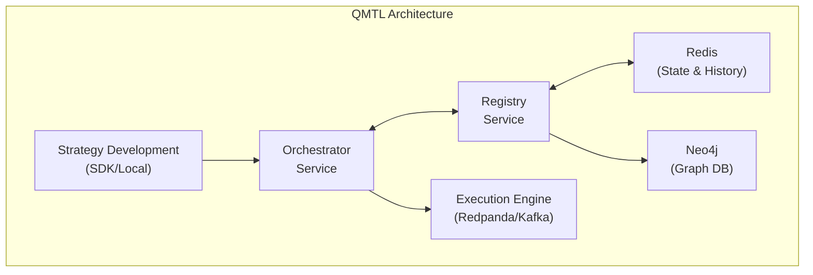
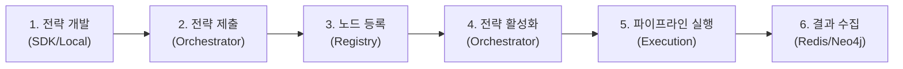
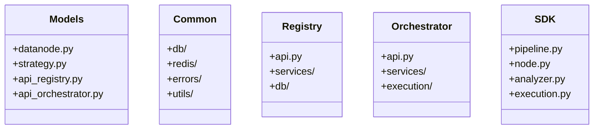
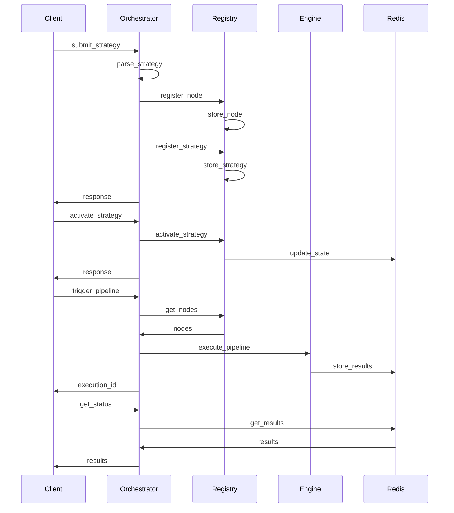

# QMTL 아키텍처 다이어그램

## 1. 시스템 아키텍처 개요

QMTL 시스템의 전체 아키텍처는 다음과 같이 구성됩니다:

## 2. 컴포넌트 역할

* **Strategy Development (SDK/Local)**: 개발자가 전략을 작성하고 로컬에서 테스트하는 환경
* **Orchestrator Service**: 전략 제출, 파싱, 활성화 및 파이프라인 실행을 관리
* **Registry Service**: 데이터 노드, 전략 메타데이터, 활성화 상태 등을 저장하고 관리
* **Redis**: 상태 정보와 히스토리 데이터를 관리하는 인메모리 데이터베이스
* **Neo4j**: 노드 간 관계와 의존성을 저장하는 그래프 데이터베이스
* **Execution Engine**: 파이프라인 실행을 담당하는 Redpanda/Kafka 기반 실행 엔진

## 3. 데이터 흐름 워크플로우

전략의 개발부터 실행까지의 전체 워크플로우는 다음과 같습니다:

## 4. 모듈 구조 다이어그램

QMTL 코드베이스의 모듈 구조는 다음과 같이 구성됩니다:

## 5. 전략 실행 시퀀스 다이어그램

전략 제출부터 실행까지의 시퀀스 다이어그램은 다음과 같습니다:

