# QMTL의 핵심 개념 및 시각화 자료

이 문서는 QMTL의 핵심 개념과 아키텍처를 시각 자료와 함께 설명합니다.

## 1. QMTL의 핵심 가치

QMTL은 다음과 같은 핵심 가치를 기반으로 설계되었습니다:

1. **선언적 파이프라인 구성**: 데이터 노드와 의존성을 선언하면 플랫폼이 실행을 관리
2. **라이프사이클 자동화**: 노드 생성, 등록, 실행, 가비지 컬렉션 등을 자동으로 관리
3. **확장성**: 로컬 개발부터 분산 환경까지 동일한 코드로 확장 가능
4. **유연한 노드 분류**: 태그 기반의 동적 노드 검색 및 조회
5. **상태 추적**: 실행 상태와 히스토리를 투명하게 관리

## 2. 시스템 구성 요소 및 관계

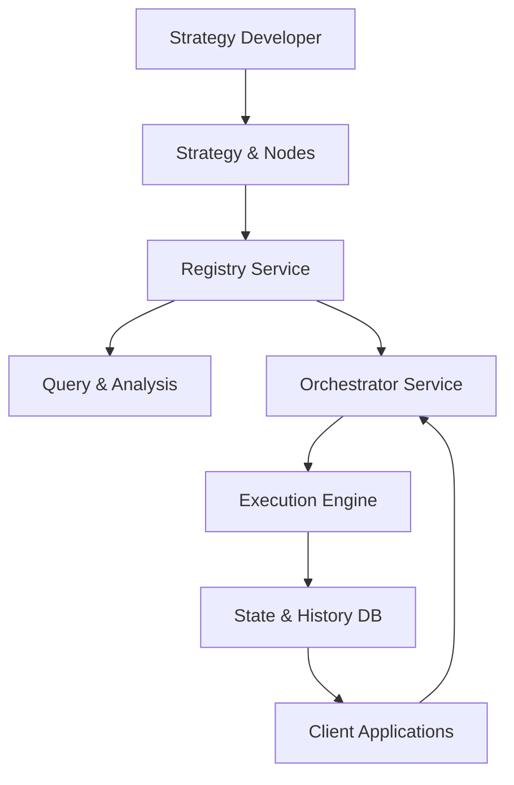

## 3. 개념 계층 구조

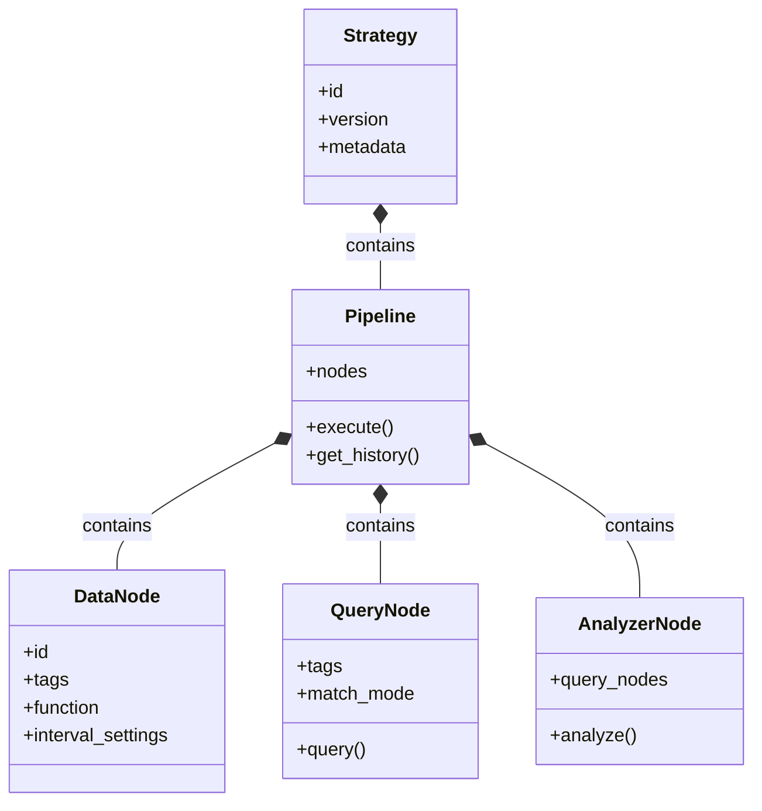

## 4. 데이터 흐름 개념도

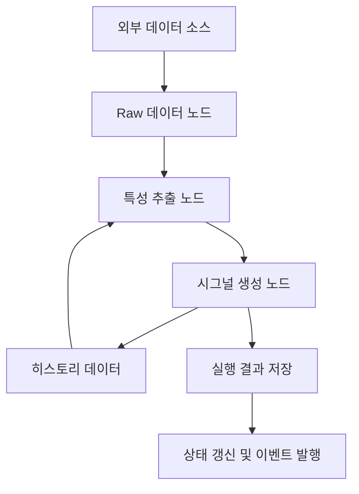

## 5. 노드 유형 및 관계

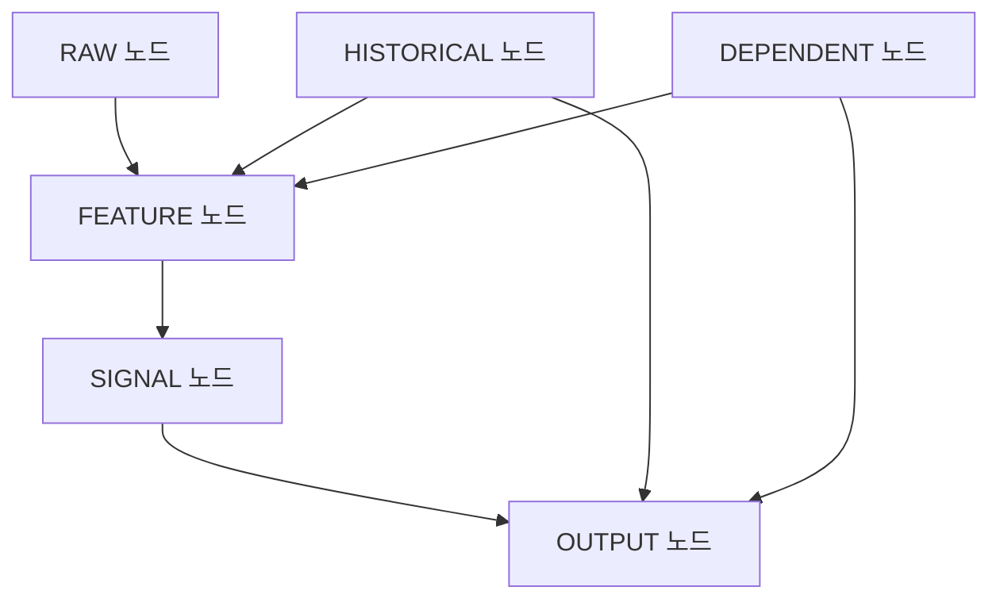

## 6. 전략 실행 흐름

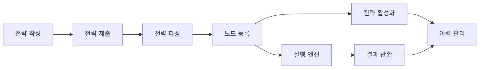

## 7. 노드 라이프사이클

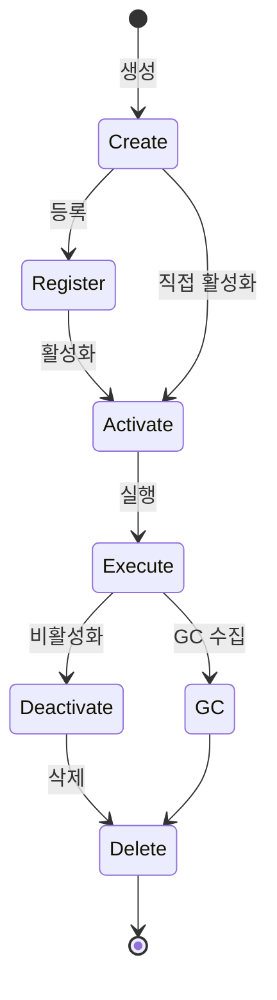

## 8. 태그 기반 노드 분류 시스템

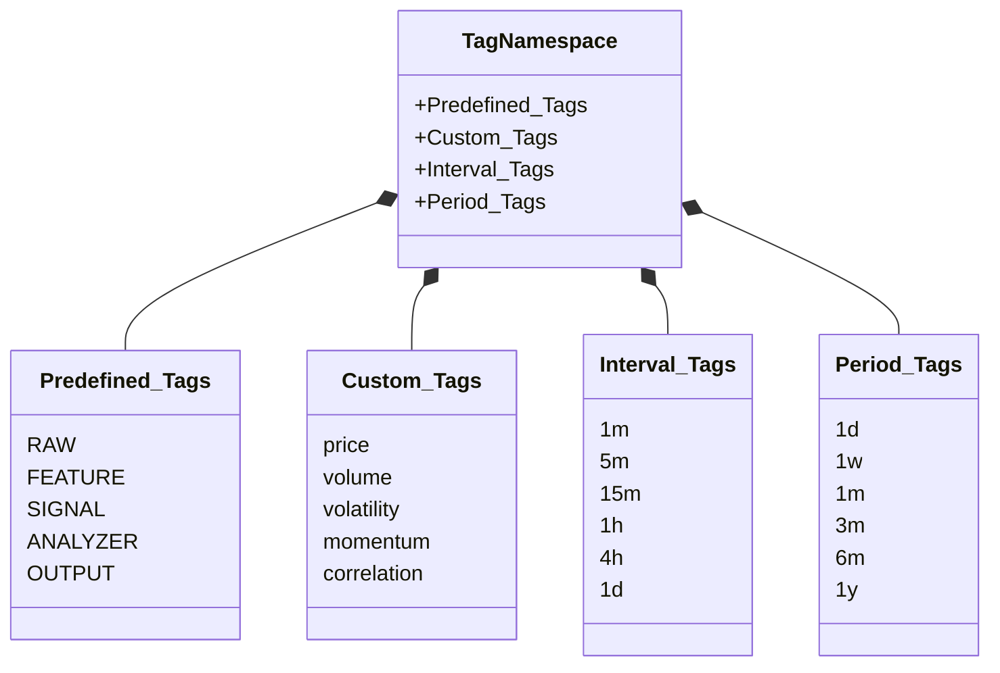

## 9. 분석기와 쿼리 노드 관계

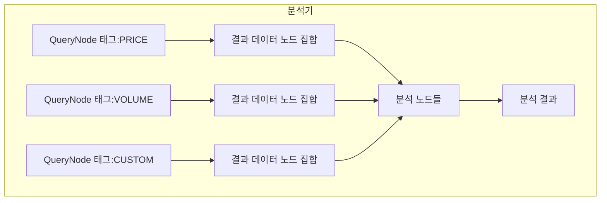

## 10. 인터벌 데이터 관리 개념

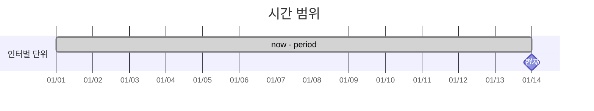

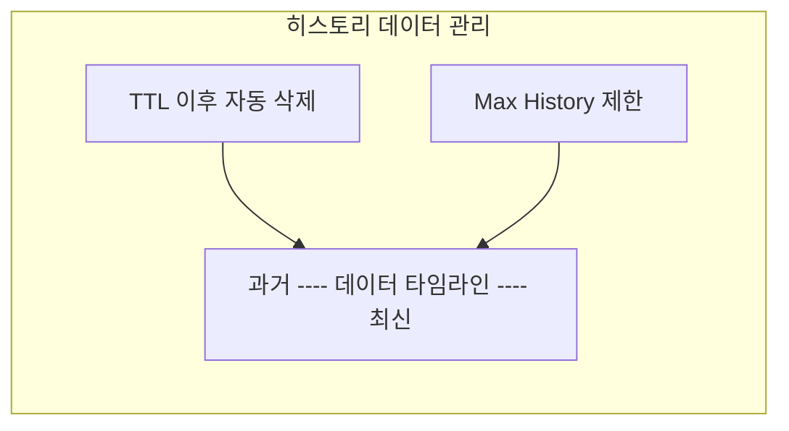

## 11. QMTL 기능별 컴포넌트 맵

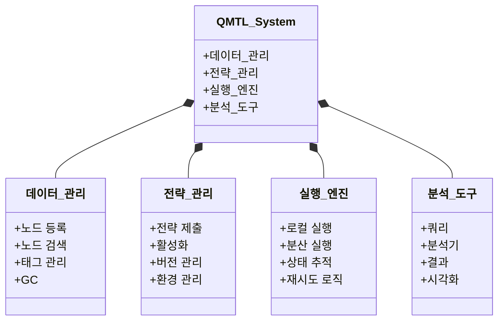

## 12. 확장 및 통합 아키텍처

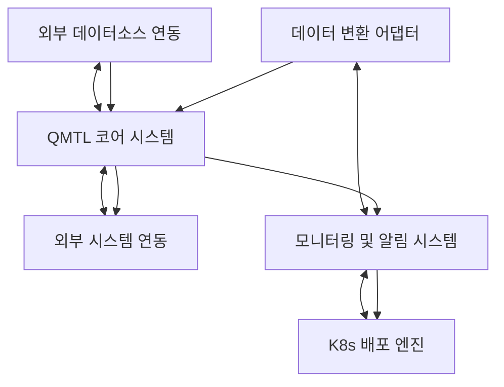

이 다이어그램과 설명을 통해 QMTL 시스템의 주요 개념과 아키텍처를 시각적으로 이해할 수 있습니다. 자세한 내용은 다음 문서를 참조하세요:

- [아키텍처 다이어그램](architecture_diagram.md)
- [용어 사전](glossary.md)
- [E2E 워크플로우 예제](e2e_workflow.md)
- [개발자 가이드](developer_guide.md) 